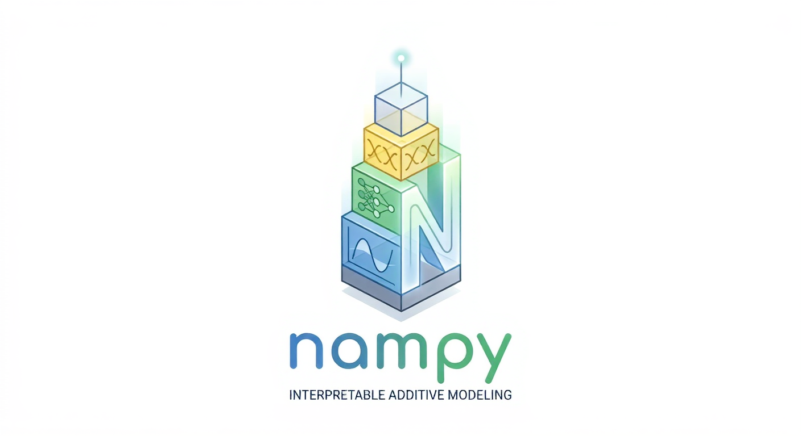

# NAMpy



[](https://www.python.org/downloads/)
[](LICENSE)
[](https://github.com/Ananyapam7/NAMpy)

NAMpy is a Python library for two families of interpretable additive models:

1. **generalized additive models (GAMs)** with statistical inference,
  automatic smoothness selection, diagnostics, and optional shape
   constraints; and
2. **neural additive models** such as NAM, NBM, IGANN, GPNAM, SIAN, SPAM,
  NodeGAM, and related architectures.

Both model families keep predictions decomposable into named terms:

```text
prediction = intercept + main effects + optional interactions + optional offset
```

NAMpy gives them a shared estimator and interpretation surface without hiding
their different numerical semantics. GAM inference remains statistical GAM
inference; neural architectures retain their own training algorithms.

## Functionality at a glance


| Model family                    | Supported functionality                                                                                                                                                                                                                           | Public surface                                                | Research references                                                                                            |
| ------------------------------- | ------------------------------------------------------------------------------------------------------------------------------------------------------------------------------------------------------------------------------------------------- | ------------------------------------------------------------- | -------------------------------------------------------------------------------------------------------------- |
| **Generalized additive models** | Formula interface; univariate, tensor-product, factor, and random-effect smooths; automatic smoothness selection; covariance and standard errors; inference and diagnostics; monotone, convex, concave, positive, and bivariate shape constraints | `GAMRegressor`, `GAMClassifier`, `GAM`                        | [Wood (2011)](https://arxiv.org/abs/0709.3906), [Pya & Wood (2015)](https://doi.org/10.1007/s11222-013-9448-7) |
| **Neural additive models**      | Regression, classification, and distributional regression; learned main effects and selected interactions; model-specific fitting; GPU execution; additive term inspection                                                                        | Registered `*Regressor`, `*Classifier`, and `*LSS` estimators | Per-model papers in the [model catalog](#model-catalog)                                                        |


Shape constraints are GAM functionality, not a separate model family. Ordinary
and constrained smooths use the same `GAM` interface and can coexist in one
fitted model.

## Installation

NAMpy supports Python 3.11 and 3.12. Install all functionality with:

```bash
pip install "nampy[all]"
```

## Quick start

#### An ordinary GAM

The sklearn-style adapters default to automatic REML smoothness selection.

```python
import numpy as np
import pandas as pd

from nampy.models import GAMRegressor

rng = np.random.default_rng(7)
x = np.linspace(0.0, 1.0, 300)
data = pd.DataFrame(
    {
        "x": x,
        "group": rng.choice(["a", "b"], size=x.size),
        "y": np.sin(2 * np.pi * x) + rng.normal(scale=0.15, size=x.size),
    }
)

model = GAMRegressor(
    formula="y ~ s(x, bs='cr', k=12) + group",
    smoothing_method="reml",
).fit(data)

prediction = model.predict(data)
summary = model.summary()
components = model.predict_components(data)
components.validate_additive_reconstruction()
```

Without a formula, the adapter creates one smooth main effect per input
column:

```python
model = GAMRegressor(k=10, basis="tp").fit(X_train, y_train)
prediction = model.predict(X_test)
standard_error = model.standard_errors(X_test)
```


#### A gradient-trained NAM

```python
from nampy.models import NAMRegressor

model = NAMRegressor(
    layer_sizes=[64, 32],
    dropout=0.1,
    numerical_preprocessing="minmax",
).fit(
    X_train,
    y_train,
    max_epochs=100,
    batch_size=128,
    patience=12,
    random_state=7,
)

prediction = model.predict(X_test)
components = model.predict_components(X_test, center=True)
importance = model.term_importance(X_test)
figures = model.plot_terms(X_test)
```


## Generalized additive models

NAMpy's GAM implementation covers the statistical model lifecycle from formula
parsing and smooth construction through fitting, prediction, inference, and
diagnostics. Ordinary and shape-constrained terms share the same formula,
result, and prediction interfaces.

### Ordinary GAM functionality


| Formula surface    | Supported terms                                                                                      |
| ------------------ | ---------------------------------------------------------------------------------------------------- |
| Univariate smooths | `s(..., bs='cr')`, `cs`, `cc`, `ps`, `tp`, `ts`                                                      |
| Structured smooths | random effects `re`, factor smooths `fs`, sum-to-zero factor smooths `sz`                            |
| Tensor products    | `te(...)` and `ti(...)` over supported numeric marginals                                             |
| Parametric terms   | numeric and factor terms, supported interactions, intercept policies, and formula offsets            |
| Shared smoothing   | supported `id=` groups, fixed/free smoothing parameters, `select=True`, and `pc=` on supported bases |


### Shape-constrained functionality

Selecting one of the following bases applies the corresponding constraint
during fitting. The constraint is encoded in the smooth and coefficient
parameterization rather than imposed by modifying predictions afterward.


| Constraint                  | Basis codes                                                                                                                                                        |
| --------------------------- | ------------------------------------------------------------------------------------------------------------------------------------------------------------------ |
| Monotone                    | `mpi`, `mpd`                                                                                                                                                       |
| Convex or concave           | `cx`, `cv`                                                                                                                                                         |
| Monotonicity and curvature  | `micx`, `micv`, `mdcx`, `mdcv`                                                                                                                                     |
| Positive                    | `po`, `ipo`, `dpo`, cyclic-positive `cpop`                                                                                                                         |
| Anchored monotone           | `miso`, `mifo`                                                                                                                                                     |
| Numeric-by variants         | `mpiby`, `mpdby`, `micxby`, `micvby`, `mdcxby`, `mdcvby`, `cxby`, `cvby`                                                                                           |
| Local constraints           | `lmpi`, `lipl` with the change point supplied through `xt`                                                                                                         |
| Bivariate shape constraints | `tedmi`, `tedmd`, `temicx`, `temicv`, `tedecx`, `tedecv`, `tecxcx`, `tecvcv`, `tecxcv`, `tescx`, `tescv`, `tesmi1`, `tesmd1`, `tesmi2`, `tesmd2`, `tismi`, `tismd` |


Shape-constrained functionality includes fixed smoothing, the supported automatic BFGS GCV/UBRE path, exponential and softplus positive transforms, transformed covariance, prediction standard errors, summaries, residuals, first and second derivatives, linear-functional terms, and supported Gaussian AR(1) errors.

### Families, selection, and output


| Surface                   | Supported behavior                                                                                                                                 |
| ------------------------- | -------------------------------------------------------------------------------------------------------------------------------------------------- |
| Ordinary families         | Gaussian, binomial, Poisson, and Gamma with the implemented canonical and noncanonical links                                                       |
| Extended families         | negative binomial (`nb` and fixed-theta `negbin`), beta regression (`betar`), Tweedie (`tw`), and ordered categorical (`ocat`)                     |
| Multi-predictor families  | `gaulss` and `gammals`                                                                                                                             |
| Smoothness criteria       | fixed smoothing, GCV/Cp, UBRE, ML, REML, and general-family LAML where the selected family and model combination supports them                     |
| Smoothness optimizers     | outer Newton, BFGS, EFS, and guarded `optim`/L-BFGS-B routes                                                                                       |
| Prediction                | link, response, terms, interaction terms, linear-predictor matrices, and pointwise standard errors                                                 |
| Inference and diagnostics | covariance choices, derivatives, residuals, summaries, ANOVA, log likelihood, AIC/BIC, concurvity, `k_check`, `gam_check`, and plot data/rendering |


Support is intentionally combination-specific. Unsupported inputs raise an
explicit error rather than silently selecting an approximate fallback.
Important exclusions include `t2`, Gaussian-process, MRF, adaptive and soap
smooths, `paraPen`, NCV/QNCV, several matrix-covariate combinations, and
shape-constrained optimizer branches not listed in the dedicated guide.

The stable low-level `nampy.gam` API is deliberately small: `GAM`,
`fit_model_core`, `solve_fit`, and `FitCoreSolution`.

## Neural additive models

NAMpy provides multiple neural additive architectures behind consistent
regression, classification, and distributional-regression APIs. Models retain
their published structural and training differences while sharing data
preparation, prediction, scoring, persistence, and term-inspection conventions.

### Model catalog

Architecture names link directly to their corresponding papers where an exact
research reference exists. NAMpy-native extensions remain unlinked.


| Architecture                                                                                                                                      | Model idea                                                                                 |
| ------------------------------------------------------------------------------------------------------------------------------------------------- | ------------------------------------------------------------------------------------------ |
| Neural Linear Regression (LinReg)                                                                                                                 | Neural-objective-compatible linear baseline                                                |
| [Neural Additive Models (NAM)](https://proceedings.nips.cc/paper_files/paper/2021/hash/251bd0442dfcc53b5a761e050f8022b8-Abstract.html)            | One feature network per logical feature, with optional explicit interactions               |
| [Sparse Interaction Additive Networks (SIAN)](https://arxiv.org/abs/2209.09326)                                                                   | Sparse higher-order additive terms discovered with Archipelago/FIS                         |
| [Sparse Neural Additive Models (SNAM)](https://arxiv.org/abs/2202.12482)                                                                          | NAM subnetworks with group-lasso feature and term sparsity                                 |
| [Gaussian Process Neural Additive Models (GPNAM)](https://arxiv.org/abs/2402.12518)                                                               | Random Fourier feature approximations to GP shape functions and GP-NA2M terms              |
| [Interpretable Generalized Additive Neural Networks (IGANN)](https://doi.org/10.1016/j.ejor.2023.06.032)                                          | Linear initialization followed by sequential feature-wise ELM boosting                     |
| [Neural Basis Models (NBM)](https://proceedings.neurips.cc/paper_files/paper/2022/hash/37da88965c016dca016514df0e420c72-Abstract-Conference.html) | Learned basis functions shared across features, with dense, sparse, and higher-order modes |
| [Scalable Polynomial Additive Model (SPAM)](https://arxiv.org/abs/2205.14108)                                                                     | Low-rank polynomial additive effects with local term importance                            |
| [Neural Basis Model](https://arxiv.org/abs/2205.14120)-[Scalable Polynomial Additive Model](https://arxiv.org/abs/2205.14108) (NBM-SPAM)          | NBM concepts combined with SPAM polynomial interaction structure                           |
| [Neural Attentive Tabular Transformer (NATT)](https://openreview.net/forum?id=TdJ7lpzAkD)                                                         | Additive tabular transformer representations                                               |
| [Transformer-based Neural Additive Model (NAMformer)](https://arxiv.org/abs/2504.08712)                                                           | Transformer backbone with identifiable marginal feature effects                            |
| Tree-based Neural Additive Model (TreeNAM)                                                                                                        | One differentiable neural decision tree per term                                           |
| Ensemble Tree-based Neural Additive Model (EnsembleTreeNAM)                                                                                       | Mean aggregation of multiple complete TreeNAM learners                                     |
| [Neural Generalized Additive Model (NodeGAM)](https://arxiv.org/abs/2106.01613)                                                                   | Differentiable oblivious trees with additive term extraction                               |
| Quantile Neural Additive Model (QNAM)                                                                                                             | Non-crossing additive quantile outputs                                                     |
| Spline Neural Additive Model (SplineNAM)                                                                                                          | Cubic-spline feature and interaction layers with smoothing penalties                       |


`Regressor`, `Classifier`, and `LSS` suffixes form the concrete class names, for example `NBMRegressor`, `NBMClassifier`, and `NBMLSS`. Most architectures support all three estimator types; QNAM is distributional-only, SplineNAM is regression-only, and IGANN does not advertise interaction terms.

### Distributional regression

`*LSS` estimators learn every parameter of a conditional distribution. This
surface follows the [NAMLSS framework](https://proceedings.mlr.press/v238/frederik-thielmann24a.html):
the family owns output width, valid parameter transforms, loss, prediction,
and metrics, while the registered architecture supplies additive predictors.

```python
from nampy.models import NAMLSS

model = NAMLSS(family="normal").fit(
    X_train,
    y_train,
    max_epochs=150,
    patience=15,
)

parameters = model.predict(X_test)
negative_nll = model.score(X_test, y_test)
components = model.predict_components(X_test)
components.validate_additive_reconstruction()  # raw parameter/link scale
```


| Family group         | Registered names                                                                                                        |
| -------------------- | ----------------------------------------------------------------------------------------------------------------------- |
| Continuous           | `normal`, `robustnormal`, `studentt`, `gamma`, `inversegamma`, `beta`, `lognormal`, `weibull`, `loglogistic`, `tweedie` |
| Counts               | `poisson`, `negativebinom`, `zip`, `zinb`, `hurdlepoisson`, `hurdlenegativebinom`                                       |
| Discrete and ordered | `categorical`, `ordinal`                                                                                                |
| Multivariate         | `dirichlet`, `mvnormdiag`                                                                                               |
| Quantiles            | `quantile`                                                                                                              |


## Shared interpretation contract

Both GAM and neural estimators expose `predict_components()`. It
returns an `AdditivePrediction` containing:


| Field       | Meaning                                                               |
| ----------- | --------------------------------------------------------------------- |
| `response`  | Prediction after the inverse link or distribution parameter transform |
| `link`      | Additive prediction before that transform                             |
| `terms`     | Ordered mapping from term names to link-scale contributions           |
| `intercept` | Fitted intercept contribution                                         |
| `offset`    | Optional link-scale offset                                            |


For an ordinary scalar predictor, the central invariant is:

```python
components.link == (
    components.intercept
    + sum(components.terms.values())
    + (0.0 if components.offset is None else components.offset)
)
```

Use the built-in check in application code:

```python
components.validate_additive_reconstruction()
table = model.explain_terms(X_test)
importance = model.term_importance(X_test)
interaction_importance = model.interaction_importance(X_test)
```

Neural models additionally provide component centering and term/interaction
plots. GAM estimators provide statistical smooth plots through the same public
plotting interface. For LSS models, reconstruction is defined on the raw
distribution-parameter/link scale.

## Estimator lifecycle and sklearn behavior

The two model families share estimator conventions while retaining their own
data preparation and fitting workflows. GAMs build model frames and design
matrices from formulas. Neural estimators use PreTab and the training procedure
required by the selected model.

### Neural preprocessing and training

Neural estimators use the published
[PreTab 0.0.3](https://github.com/OpenTabular/PreTab) block contract.
Preprocessing is fitted on training rows only and returns grouped numerical and
categorical feature blocks. Architectures declare how those blocks are
interpreted; for example, NAM preserves one network per logical source feature,
while NBM, SPAM, and NBM-SPAM flatten grouped blocks into scalar concepts.
GAM estimators do not use these preprocessing options.

High-level neural estimators accept preprocessing options directly:

```python
model = NAMRegressor(
    numerical_preprocessing="ple",
    categorical_preprocessing="one-hot",
    n_bins=32,
)
```

Gradient-trained models accept controls such as `max_epochs`, `max_steps`,  
`batch_size`, `patience`, learning-rate schedules, checkpoint averaging,  
sample weights, and explicit Lightning trainer arguments. Architecture-native  
and fixed-basis solvers retain their own hyperparameter meanings.

## Ensembling and persistence

`NeuralEnsemble` fits independently cloned regressors or classifiers with
optional bootstrapping and joblib parallelism:

```python
from nampy.models import NAMRegressor, NeuralEnsemble

ensemble = NeuralEnsemble(
    NAMRegressor(layer_sizes=[64, 32]),
    n_estimators=5,
    bootstrap=True,
    n_jobs=2,
    random_state=7,
).fit(X_train, y_train, max_epochs=100)

mean_prediction = ensemble.predict(X_test)
uncertainty = ensemble.predict_component_uncertainty(X_test)
```

Fitted GAM adapters and neural estimators share a versioned persistence API:

```python
path = model.save_model("model.pkl")
restored = type(model).load_model(path)
```

These artifacts use Python pickle. Load them only from trusted sources.

## Documentation and project status

NAMpy is under active development and is classified as beta. Verify advanced
family, basis, and optimizer combinations on data representative of the
intended workload.


| Resource                    | Link                                                                                     |
| --------------------------- | ---------------------------------------------------------------------------------------- |
| Quick start                 | [docs/quickstart.rst](docs/quickstart.rst)                                               |
| User guide                  | [docs/user_guide.rst](docs/user_guide.rst)                                               |
| Shape-constrained GAM guide | [docs/user_guide/shape_constrained_gams.rst](docs/user_guide/shape_constrained_gams.rst) |
| Model guide                 | [docs/models/index.rst](docs/models/index.rst)                                           |
| API reference               | [docs/api/index.rst](docs/api/index.rst)                                                 |
| Examples                    | [examples/](examples/)                                                                   |
| Tutorial notebooks          | [notebooks/](notebooks/)                                                                 |
| Changelog                   | [CHANGELOG.md](CHANGELOG.md)                                                             |


NAMpy is released under the [MIT License](LICENSE).
